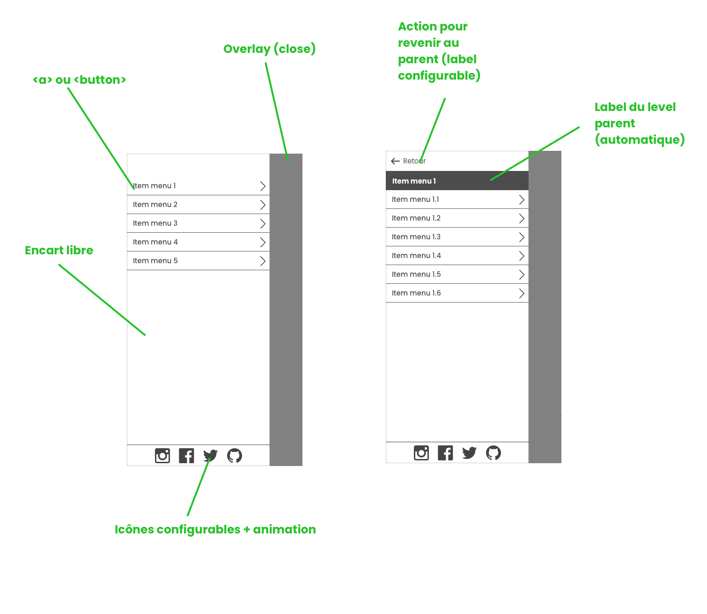

# Plugin reponsive menu

Le but est de développer un plugin facilitant la mise en place de menu responsive.

Il doit s'adapter à tous les types de menu :

* petit menu (1 à 7 items)
* grand menu avec une gestion du scroll
* mega menu avec gestion des niveaux (le plugin doit pouvoir gérer un nombre infini de niveaux même s'il n'est pas pertinent de dépasser le niveau 3 sur un site réel pour des raisons ergonomiques)

Il doit permettre en plus d'ajouter des icônes (ex: réseaux sociaux) et un encart libre où l'utilisateur peut construire son propre CSS (pour ajouter des actions custom)



## Fonctionnement

Le menu doit pouvoir s'ouvrir au clic/touch sur un élement. Lors de l'ouverture, il ajoute un overlay semi transparent sur le contenu (le contenu doit rester légèrement visible pour ne pas perdre le contexte).
L'animation d'ouverture doit être fluide et simple (éventuellement configurable). La fermeture peut se faire en touchant l'overlay ou en glissant le doigt vers la gauche (avec un effet d'inertie comme une appli native)

## Instanciation à partir d'un HTML

```html
<button data-rmenu-btn>Menu</button>
<nav class="rmenu" id="rmenu">
  <div class="rmenu__links">
    <ul>
      <li><a href="#">Item 1</a></li>
      <li><a href="#">Item 2</a></li>
      <ul>
        <button>Item 2</button>
        <li><a href="#">Item 2.1</a></li>
        <li><a href="#">Item 2.2</a></li>
        <ul>
          <button>Item 2.3</button>
          <li><a href="#">Item 2.3.1</a></li>
          <li><a href="#">Item 2.3.2</a></li>
        </ul>
      </ul>
    </ul>
  </div>

  <div class="rmenu__actions">
    // prévoir ici un encart libre pour ajouter des actions comme un bouton de login, un panier, etc...
  </div>

  <div class="rmenu__icons>
    <a href="#"><svg>...</svg></a>
    <a href="#"><svg>...</svg></a>
    <a href="#"><svg>...</svg></a>
    <a href="#"><svg>...</svg></a>
  </div>
</nav>
```

Instanciation du plugin :

```js
new ResponsiveMenu({
  target: document.querySelector('#rmenu'),
  trigger: document.querySelectorAll('[data-rmenu-btn]'),
  onOpen: function() {
    //...
  },
  onClose: function() {
    //...
  }
})
```

## Arborescence à partir d'un JSON

Dans certains cas (souvent pour des raisons de SEO, il n'est pas pertinent que le menu apparaisse dans le HTML). Dans ce cas, le plugin doit pouvoir prendre un json pour créer l'arborescence du menu.
À noter qu'il est possible de passer en plus n'importe quel attribut HTML qui sera ajouté sur l'item en question (class, data, id).

```json
{
  "items": [
    {
      "label": "item1",
      "sub": [
        {
          "label": "item 1.1",
          "link": "..."
        },
        {
          "label": "item 1.2",
          "link": "..."
        },
        {
          "label": "item 1.3",
          "link": "...",
          "class": "custom-class"
        }
      ]
    },
    {
      "label": "item2",
      "link": "..."
    },
    {
      "label": "item3",
      "link": "..."
    }
  ]
}
```

Utilisation avec le plugin (un exemple avec fetch) :

```js
// on instancie le menu à partir du HTML sans l'arborescence
let responsiveMenu = new ResponsiveMenu({
  target: document.querySelector('#rmenu'),
  trigger: document.querySelectorAll('[data-rmenu-btn]'),
})

// on récupère l'arborescence avec une requête asynchrone (prévoir éventuellement un état de chargement si le menu s'ouvre avant la récupération de celle-ci)
fetch('./menu.json')
  .then((response) => {
    return response.json()
  })
  .then((data) => {
    responsiveMenu.setItems(data)
  })
```

## Fonctionnement avec Vue

Étudier les possibilités pour que le plugin s'adapte facilement à un site construit entièrement en Vue.js (wrapper, autre plugin, etc...).

## Build

Utiliser de préférence rollup pour créer une build UMD + esm
